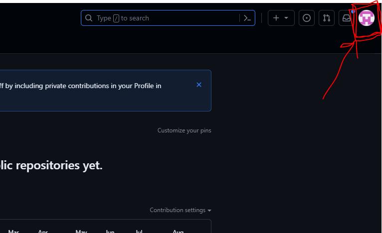

# Git Tutorial


The tutorial provided below is meant to be a quick 15 minute overview of common git commands listed in the cheat sheet, Glossary & Cheat Sheet for git. If you want more hands-on learning, the following links below are recommended tutorials based on different learning styles. Git only seems difficult, but after learning it, it's a relatively straight forward program anyone can use for collaborating with code/documents.

**Other More Indepth Tutorials**
* [Git and GitHub for Beginners - Crash Course](https://www.youtube.com/watch?v=RGOj5yH7evk) ← *1 Hour Video Course*
* [Git Branch Visual Learning Tool](https://learngitbranching.js.org/) ← *Useful for Visual Learners*
* ["The Git Parable"](https://tom.preston-werner.com/2009/05/19/the-git-parable.html) ← *Useful for Readers*
* [Git For Ages 4 And Up](https://www.youtube.com/watch?v=1ffBJ4sVUb4) ← *Advanced Git Explained Plainly*


## WTF is git
**Git** is a [version control](https://en.wikipedia.org/wiki/Version_control) system that tracks changes in files for use of coordination and collaboration amongst other programmers on different computers. When working on a new "feature" for software, developers will typically create a new `feature/*` branch that can track code changes independent from the default or `main` branch.

When code is ready to deploy, the feature and main branch will merge together with the new applied changes in the feature branch. Git makes record of all changes committed to a project which makes it easy to track when problems occur.

Git is a local program that runs on your machine as a CLI (Command Line Interface, i.e. your terminal or command prompt). Git should not be confused with github which is a website that hosts git repositories.

There's dozens of front-ends now that visualize git flow and operations, even some included in IDEs (Integrated Development Environment). Search for visual git applications for more information on those. These gui programs execute git in the background and contrary to convention, it can sometimes be more confusing than using the command line.

If you’re thinking to yourself, *Git sounds like that British Insult for a stupid, contemptable, and/or simple person*, that’s intentional, the creator of `git` is Linus Torvalds, also the original author of linux, and he’s known for his crass sense of humor.

```
Because I'm a bastard, and proud of it!
    - Linus
```

## Setting up git

### Windows
1. Navigate to the latest [Git For Windows](https://git-scm.com/download/win) installer and download the latest 64 bit standalone version.

2. Go through git bash installer wizard until...

   **VERY IMPORTANT:** Installing git bash has a ton of options, you can select the default option for most, but make sure when you get to this screen you select **"Use Git and optional Unix tools from the Command Prompt"**

    

4. Open the windows command prompt (or **Git Bash** if you selected not to use the standard Git Windows Command Prompt during the Git installation).

5. Type `git version` to verify Git was installed.

### Mac
Mac bundles `git` with their developer tools, simply type `git` into the terminal and follow the instructions that the prompt gives you. 

### Linux/WSL

Use the package managers and guides for your flavor located [here](https://git-scm.com/download/linux).

If you're in this section you probably already know how to do this, *why are you here?*

### Authentication

#### Setting up a "Key Pair"

**NOTE:** *This series of steps might seem bizarre, you might be thinking "Isn't authentication just setting up a username and password?". That's one type of authentication, but for ease of use CLIs like git sometimes use keys to securely communicate with services so we don't have to always input username and password all the time. If you want a quick, simple explanation of what's going on here, see the video [Secret Paint Mixing - Applied Cryptography](https://www.youtube.com/embed/d_FU9tZIo10?showinfo=0)*

1. Open Git Bash or Terminal

2. Generate a Key using the command below
    ```bash
    ssh-keygen -t ed25519 -C "your.name@gmail.com"
    # you will see something output like this...
    # > Generating public/private ALGORITHM key pair.
    ```

3. Just press enter through the next prompts, do not add a passphrase unless you're willing to always be prompted for it.

    ```bash
    # > Enter a file in which to save the key (/c/Users/YOU/.ssh/id_ALGORITHM):[Press enter]
    ```

4. Check that ssh-agent is running

    ```bash
    eval "$(ssh-agent -s)"
    # you will see something output like this...
    # > Agent pid 59566
    ```

5. Add your new SSH key to the "ssh-agent", i.e. git doesn't know what key it needs to use, this will tell it to use that key.

    ```bash
    ssh-add ~/.ssh/id_ed25519
    ```

6. Copy your "public" key

    ```bash
    cat ~/.ssh/id_ed25519.pub
    # you will see something output like this... Copy the WHOLE line, "ssh" to the email.
    # ssh-ed25519 LKWKLWEJKLFaehjkwhwkejhfweK23423kl235klknngnawhherh5233423lslkeklJ/LKWKJLERKLWEKLlwkerWFLK your.name@gmail.com
    ```

7. Go to github, navigate to your profile menu (top right of the screen), screenshot of its location here.

    

8. Go to your settings

    

9. Go to "SSH and GPG keys"

    

10. Click "New SSH Key"

    

11. Create some title for the public key, then copy the "public key" you copied in step 6 into the box. Press Add SSH Key. 

Congrats you setup authentication!

## Cheat Sheet
```bash
# Clone a new project
git clone git@github.com:LizardBrainDev/git_cheatsheet.git

# Create a branch and switch to it
git checkout -b branch/name

# Checkout an existing local branch
git checkout branch/name
git checkout main # checkout the default main branch

# List branchs
git branch
git branch -r # list out remote branches

# Delete a branch
git branch -D branch/name # note the uppercase D, it's case sensitive

# Sync your current branch with remote
git pull

# Stage changes prior to committing
git add some/file.name
git add . # add all files in the directory

# Reset something in the staging area
git reset some/file.name
git reset # reset the whole staging area
git reset --hard # Reset all registered files in the git repo back to their original state of the commit (nuclear option)

# Commit changes in your staging area
git commit -m "Description of changes" # without the description it will prompt you with the default text editor for a change description, not a pleasant experience

# First local branch push to remote repository
git push --set-upstream origin branch/name

# Push local commits to remote, the branch must first "track upstream changes" on remote like above.
git push

# Whoops! Undo a mistaken commit.
git commit -m "Something terribly misguided"    # Initial Bad Commit
git reset HEAD~                                 # Step 1
# Edit files as necessary                       # Step 2
git add .                                       # Step 3
git commit -c ORIG_HEAD                         # Step 4
```

## Tutorial

### Example Project

1. Check `git` is installed with the command,
    
     ```bash
     git --version
     ```
2. Clone the example git repository into a projects or documents folder

    ```bash
    git clone git@github.com:LizardBrainDev/git_cheatsheet.git
    ```

    **NOTE**: If you are getting permission denied errors, see the Authentication section above. 

3. Clone the Example Repository

    Clone this repository with the command 
    
    ```bash
    git clone git@github.com:LizardBrainDev/git_cheatsheet.git
    ```

    

    **NOTE:** *Typically you can find the github repo link on the repository page, located at the "code" button, select the option "ssh"*

    

4. Change into the new directory

    Use this command to **C**hange **D**irectory to the local `git_tutorial` repository folder

    ```bash
    cd git_tutorial
    ```

    By default you're on the `main` branch. You can see which branch you're on with `git status`.

    

5. Make a new uniquely named branch. This is where new features for the code base will be made, so it will be under the branch grouping `feature/`

    ```bash
    git checkout -b feature/[some unique name]
    # checkout is the command for switching branches
    # -b is an argument prompting for a new branch
    # feature/[some unique name] is the name of the new branch
    #   * replace [some unique name] with something unique
    ```

    

6. Create new files to add to the codebase

    ```bash
    touch somecoolcodefile.py
    # touch is the command for making a new empty file with a given name.
    ```

7. Check status of your code with `git status`

    `status` is the git functionality for your staging area. It will list unstaged files in red and staged files in green. Unstaged files are not included in commits

    

8. Add your new file to staging and commit it.

    ```bash
    git add .
    # add is the command for staging new files to be committed.
    # The bash shorthand . means "stage everything"
    ```
    review the staging area with `git status`

9. Commit the staging area to your branch with 
    ```bash
    git commit -m "added a cool new feature"
    # commit is the command for committing new code
    # -m is the argument for a commit message, everything in the quotations are added as the message.
    ```

    **NOTE:** *if you do not close your quotations it will make a blank prompt, don't panic, this just means the interpreter thinks you want to add more lines to the commit message, just hit ENTER to continue*

    

10. Now that the file has been committed, this is living on your **local** git and needs to be pushed to the **remote** repository for the whole team to see.

    Use `git push` to push to remote

    If this is your first time pushing the branch to remote, it's not going to work, but it produces a useful command for adding the upstream for your first push that we can copy

    Copy the prompted suggestion to your prompt, in this use-case it's 
    
    ```bash 
    git push --set-upstream origin feature/[some unique name]
    ```

    

11. Create a **pull request** to merge new code into the `main` branch.

    Go to this repository, https://github.com/LizardBrainDev/git_cheatsheet, and click on "Pull Requests"

    Next press the "new pull request" button

    

    Next select the new feature branch to merge into `main`

    

    Review Changes and click "Create Pull Request"

    

    Your commit message will auto populate as the title of this merge, create a new one if you need to, and add comments if necessary. Then create the pull request

    

12. Merge your code into `main`

    In a normal situation someone should review changes then approve of them, which will allow you to merge the code to the `main` branch, but this repo does not have those protections. Hit "merge pull request" to merge into `main`

    

Congrats, your new feature is merged into the `main` branch!

**NOTE: ** *If this seems like a daunting amount of steps or your brain is mush by now, don't worry, over time a sort of muscle memory kicks in after some repetitive use and is a pretty simple and straight forward task. Feel free to keep practicing with this repository, it's what it was made for.*

## Glossary

*Git and Github use a lot of creative terminology to describe its process, refer to this glossary or research online if confused.*

* **commit**: a git object, a snapshot of your entire repository
    * Usually represented as a dot in diagrams like above. Commits are SHA objects which is a fancy way of saying they're compressed down into uniquely referable objects. Git refers to these commits by their "SHA Signature", usually looks something like this `a9b7b4d` or longer
* **gitignore** or **.gitignore**:
    * Sometimes it may be a good idea to exclude files from being tracked with Git. This is typically done in a special file named `.gitignore`. 
    * You can find helpful templates for `.gitignore` files at [GitHub - github/gitignore: A collection of useful .gitignore templates](https://github.com/github/gitignore).
* **branch**: a lightweight movable pointer to a commit
    * Usually represented as a line/branch in diagrams like above. A branch will group commits together into a named domain.
    * [Branch Visualization Learning Tool](https://learngitbranching.js.org/) <— FOR VISUAL LEARNERS
* **merge**: the process for merging together two branches together
    * Typically for introducing new code to another branch, especially the default branch.
* **pull request**: This is a procedure on remote repositories for discussing differences introduced on a proposed branch merge with reviews, comments, integrated tests, etc. prior to merging two branches together.
* **checkout**
    * Any commits you make will be made on the branch you're currently “checked out” to. Use `git status` to see which branch that is.
* **clone**: a local version of a repository, including all commits and branches
* **local**: This refers to your local machine, i.e. your laptop, desktop, VM, etc.
* **remote**, a.k.a. origin: a machine that hosts a common repository that all team member use to exchange their changes. This is what Github is, a website for easily hosting remote repositories.
    * When making commits/branches on local, they are only saved on your computer until "pushed" to "remote"
    * the default reference for remote is origin, but you can name it anything you want or have more than one remote repository (not ideal to do). A remote branch will be referred with its remote marker before the rest of the name. For example the `main` branch will likely show as `origin/main` in the remote repository.
* **fetch**: Downloads all history from the remote tracking branches
* **pull**: Updates your current local working branch with all new commits from the corresponding remote branch on GitHub.
    * `git pull` is a combination of `git fetch` and `git merge`
